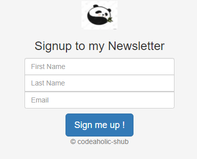
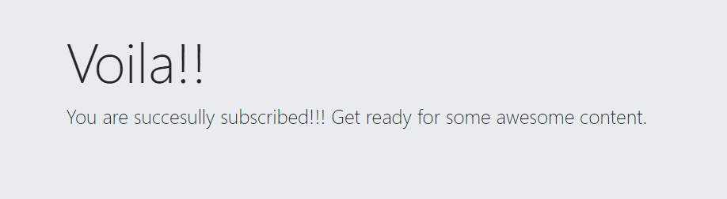
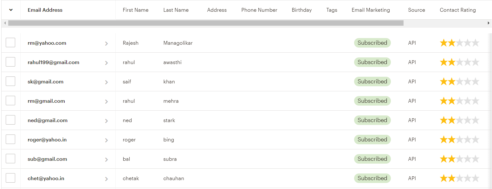
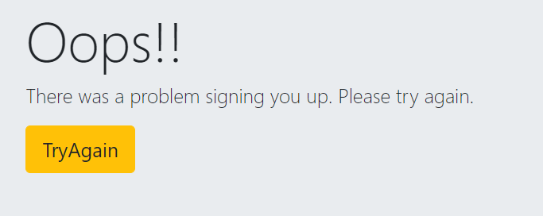

# Newsletter Signup
📰 A simple newsletter signup page to allow users to add themselves in the mailing list to receive monthly emails on new tech.

# Idea
* Sending monthly emails to the users who have signed up for the newsletter to send them news and updates on new tools and technologies
* Using Mailchimp services to store and manage the emails of the users along with other details

# Tools Used
* Used HTML5, CSS3, Bootstrap, Node.js, Express.js and JavaScript to develop the page

# API
* Used the Mailchimp's API

# How to sign up
* On the home page, the user can see a simple UI to sign up
* All the fields are mandatory
* When user fills up all the fields, the sign up button can be clicked
* If successful, user is taken to a success page, else a failure page is displayed
* When something goes wrong and failure page is displayed, user can click on **Try Again** button to go back to the sign up home page.

# After sign up
* User's data gets added on the mailchimp's server
* The data can be used to send monthly emails

# Screenshots

